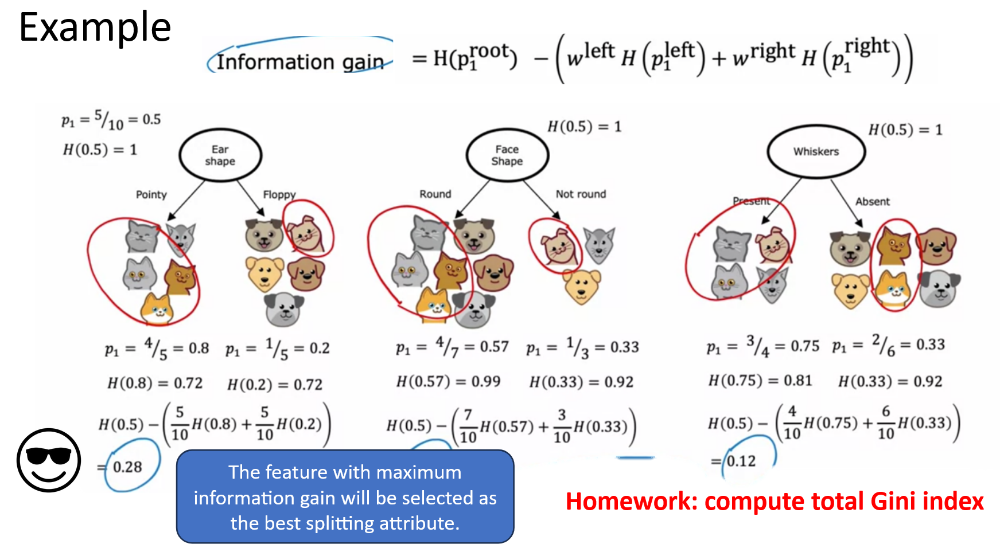

# HW1: Compute Total Gini Index of given example

## Ear Shape 
>Pointy

p1 4/5 = .8, p2 1/5 = .2

gini = 1 - (.8)^2 - (.2)^2 = .32

weighted gini = .32 * 5/10 = .16

>Floppy 

p1 1/5 = .2, p2 4/5 = .8

gini = 1 - (.2)^2 - (.8)^2 = .32

weighted gini = .32 * 5/10 = .16

### sum weighted gini of node = .16 + .16 = .32

## Face Shape
>Round  

4/7 = .57

3/7 = .43

gini = 1 - (.57)^2 - (.43)^2 = .49

weighted gini = .49 * 7/10 = .343

>Not Round 

1/3 = .33

2/3 = .67

gini = 1 - (.33)^2 - (.67)^2 = .44

weighted gini = .44 * 3/10 = .132

### sum weighted gini of node = .343 + .132 = .475

## Whiskers
>Present 

3/4 = .75

1/4 = .25

gini = 1 - (.75)^2 - (.25)^2 = .375

weighted gini = .375 * 4/10 = .15

>Absent  

2/6 = .33

4/6 = .67

gini = 1 - (.33)^2 - (.67)^2 = .44

weighted gini = .44 * 6/10 = .264

### sum weighted gini of node = .15 + .264 = .414